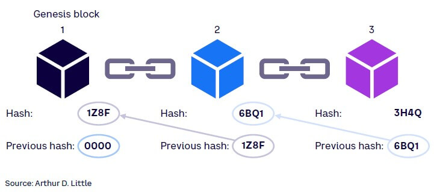
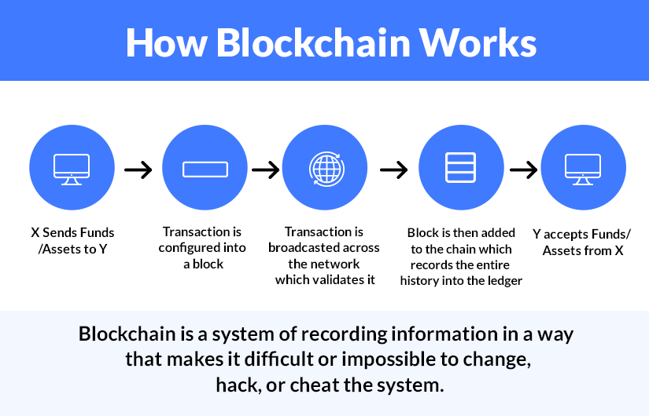
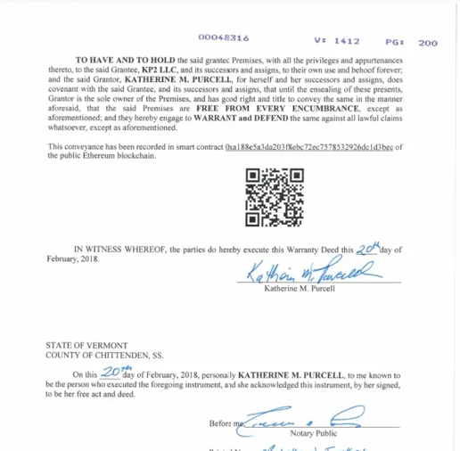

# Scala PoW blockchain project

# Wstęp

Projekt to prosta implementacja blockchaniu proof-of-work stworzona w języku Scala.

# Czym jest blockchain?

Blockchain to technologia, która umożliwia przechowywanie i przesyłanie danych w sposób bezpieczny, niezmienny i zdecentralizowany. Jest to rodzaj rozproszonej księgi rachunkowej, która przechowuje informacje w blokach połączonych ze sobą w łańcuchu.



# Jak działa blockchain?

Blockchain działa na zasadzie rozproszonej sieci, w której każdy użytkownik (węzeł) ma kopię całego łańcucha bloków.
Każdy blok zawiera dane:

- znacznik czasu
- hash poprzedniego bloku.

W celu dodania nowego bloku do łańcucha, użytkownicy muszą rozwiązać skomplikowany problem matematyczny, który wymaga dużej mocy obliczeniowej. Proces ten nazywany jest dowodem pracy (Proof of Work) i ma na celu zapewnienie bezpieczeństwa transakcji.
Popularnie ten proces nazywa się również kopaniem bloku.

Informacja o hashu bloku-poprzednika sprawia, że łańcuch jest **niezmienialny**.



# Jakie problemy rozwiązuje blockchain?

## Transparentność

Blockchain zapewnia pełną transparentność transakcji, ponieważ każdy użytkownik ma dostęp do historii transakcji.

## Bezpieczeństwo

Immutowalność bloków w blockchainie sprawia, że raz zapisane dane stają się trwałym, audytowalnym rekordem, który jest bardzo trudny do zmiany bez zgody większości sieci. To sprawia, że blockchain jest wyjątkowo bezpieczny w kontekście przechowywania dowodów własności, transakcji finansowych, umów, a także w aplikacjach wymagających wysokiego stopnia niezmiennego, transparentnego rejestru danych.

## Źródła

- [Przechowywanie ksiąg wieczystych na blockchainie](https://www.govtech.com/biz/heres-what-a-blockchain-property-deed-looks-like.html)

# Przykłady użycia

- Księgi wieczyste
  W stanie South Burlington w stanie Vermont w USA, księga wieczysta została zapisana na sieci Ethereum.
  Dokument wygląda standardowo, ale na samym końcu jest hash transakcji w której jest zapisana kopia księgi wieczystej.
  

- Systemy głosowania - blockchain może być wykorzystany do stworzenia bezpiecznego, niezmienialnego systemu głosowania, który zapewnia pełną transparentność i bezpieczeństwo wyborów.

- Opieka medyczna, dokumenty państwowe itp.

## Funkcje

- **Tworzenie bloków**: Możliwość dodawania nowych bloków do łańcucha z odpowiednim dowodem pracy.
- **Proof of Work**: Implementacja algorytmu PoW w celu zapewnienia bezpieczeństwa transakcji.
- **Weryfikacja łańcucha**: Sprawdzanie poprawności całego łańcucha, aby upewnić się, że dane nie zostały zmienione.
- **Prosty interfejs API**: Umożliwienie interakcji z blockchainem poprzez proste wywołania API.

## Technologie i narzędzia

Projekt wykorzystuje:

- **Scala**
- **SBT**
- **Play Framework**
- **scalatest**

## Co zostało zrezlizowane

- prosta implementacja blockchainu PoW
- API do wyciągania danych
- tetsy z użyciem scalatest

## Wymagania

- Scala 2.13 lub nowsza
- Java 8 lub nowsza
- SBT (Scala Build Tool)

## Spostrzeżenia

- przy stosowaniu wzorca singleton, tworzymy `object` zamiast `class`, różni się to np. od Javy
- dodawanie extensions, czyli metod do instniejących już klas, realizuje się przez implicit class, porównanie:

Koltin

```kotlin
fun String.shorten(n: Int = 3): String {
    return if (this.length <= 6) this else "${this.take(n)}...${this.takeLast(n)}"
}
```

Scala

```scala
object StringUtils {
  implicit class RichString(str: String) {
    def shorten(n: Int = 3): String = {
      if (str.length <= 6) {
        str
      } else {
        val firstPart = str.take(n)
        val lastPart = str.takeRight(n)
        s"$firstPart...$lastPart"
      }
    }
  }
}
```

- framework Play jest w zasadzie dość szybko konfigurowalny, przyjemnie się nam z nim pracowało
